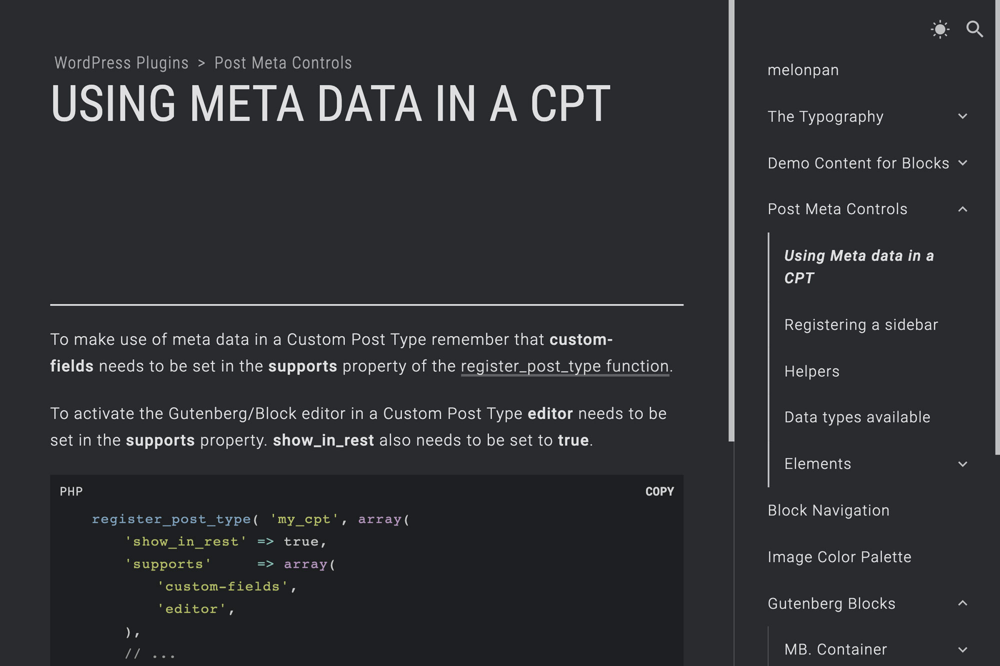

# Tamachi WordPress Theme

[Demo](https://melonpan.io)

 

WordPress theme used for the documentation of melonpan themes and plugins.

 

## Notes

This theme is currently in beta stage. This means that although it works (as can be seen in the [demo page](https://melonpan.io)) its code base could change.

 

## Features

- Built in TypeScript with React, using hooks and the Context API.
- It loads content dynamically and updates the browser routes based on the current page.
- To improve SEO it renders the initial page content from the server and hydrates it into React.
- It comes with a color scheme toggle button. Depending on the user OS color scheme the theme will initially display in a light or dark scheme. If toggled this setting will remain in the browsers localstorage so it can persist after a refresh.
- The search field makes REST calls to get the results and display them without reloading the page.
- Breadcrumbs are built into every page where they are available (page hierarchy, taxonomies, etc.).
- Pages that share the same parent page will display a "Next post" link at the bottom of the page.

 

## How to set the theme

Create a page (you might want to call it "Home") and assign it to the Homepage in Settings > Reading.

The demo page is using of the plugins [Melonpan Block - Site Title](https://wordpress.org/plugins/melonpan-block-site-title) and [Melonpan Block - Post List](https://wordpress.org/plugins/melonpan-block-post-list). With these plugins a list of posts/pages can be set that the theme will recognise and load dynamically when the user clicks on them.

Create a menu in Appearance > Menus and assign it to the "Sidebar Menu" display location. If you would like a menu item to work as a toggle to expand/collapse without being assigned to a page/post, create a Custom link and assign it # as the url.

 

## Screenshots

