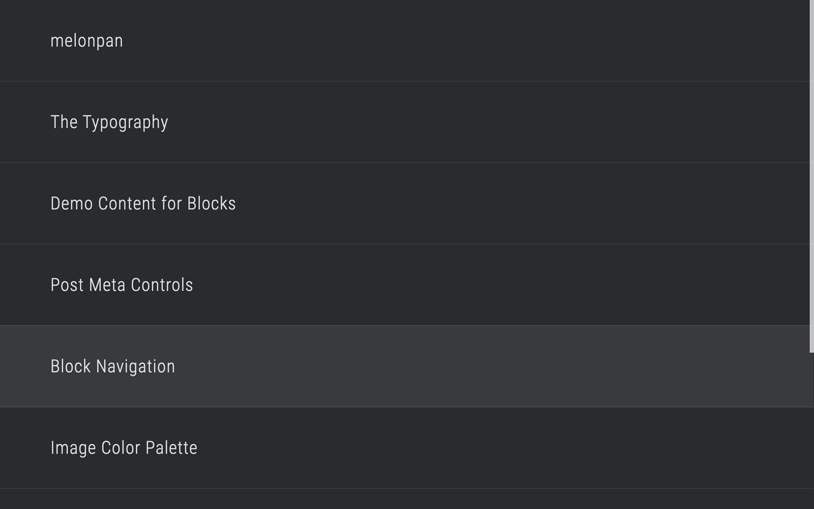
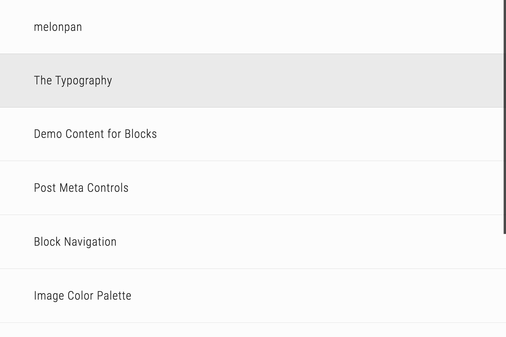
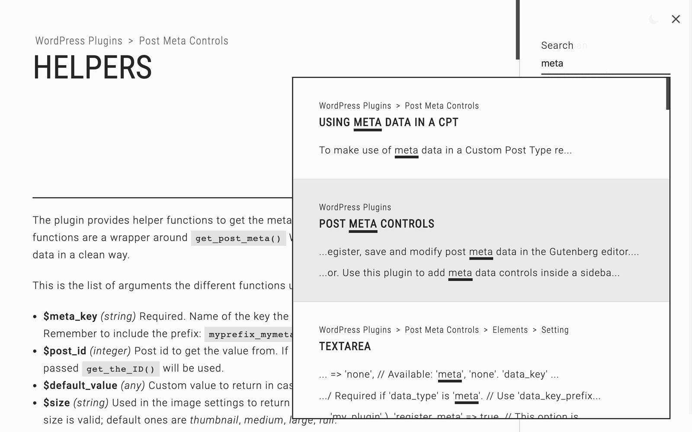
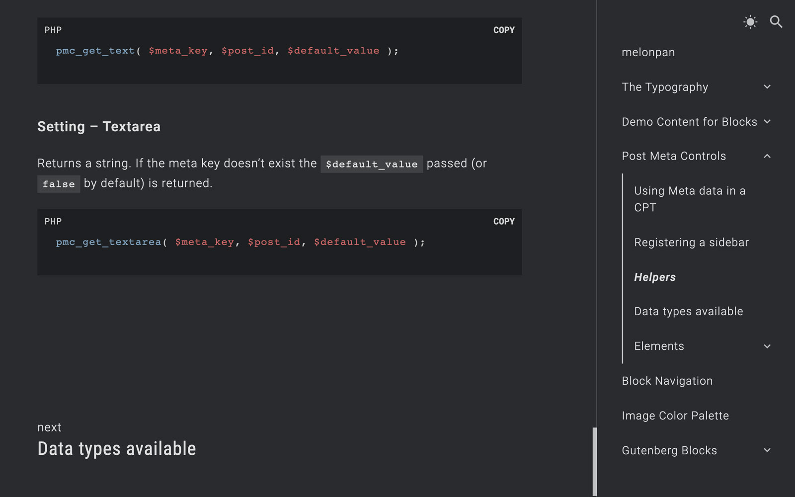

# Tamachi WordPress Theme

[Demo](https://melonpan.io)

 

WordPress theme used for the documentation of melonpan themes and plugins.

 

## Features

- Built in **TypeScript with React**, using hooks and the Context API.
- Content is loaded **dynamically** and the browser routes are updated based on the current page.
- To improve **SEO** the initial page content is rendered from the server and hydrated into React.
- A **color scheme toggle button** is included. Depending on the user OS color scheme the theme will initially display in a light or dark scheme. If toggled this setting will remain in the browsers localstorage so it can persist after a refresh.
- The **search field** makes REST calls to get the results and display them without reloading the page.
- **Breadcrumbs** are built into every page where they are available (page hierarchy, taxonomies, etc.).
- Pages that share the same parent page will display a **"Next post"** link at the bottom of the page.

 

## How to set the theme

Create a page (you might want to call it "Home") and assign it to the _Homepage_ in _Settings > Reading_.

The demo page is using the plugins [Melonpan Block - Site Title](https://wordpress.org/plugins/melonpan-block-site-title) and [Melonpan Block - Post List](https://wordpress.org/plugins/melonpan-block-post-list). Using the later a list of posts/pages can be set that the theme will recognise and load dynamically when the user clicks on them.

Create a menu in _Appearance > Menus_ and assign it to the _Sidebar Menu_ display location. To create a menu item that works as a toggle to expand/collapse, without being assigned to a page/post, simply add a Custom link and assign it _#_ as the url.

 

## Screenshots

